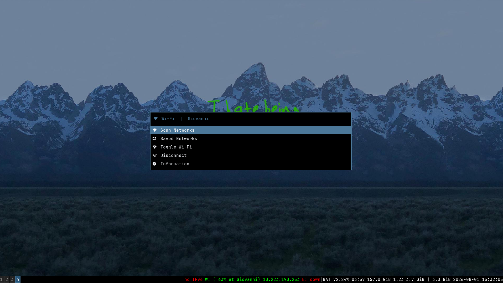
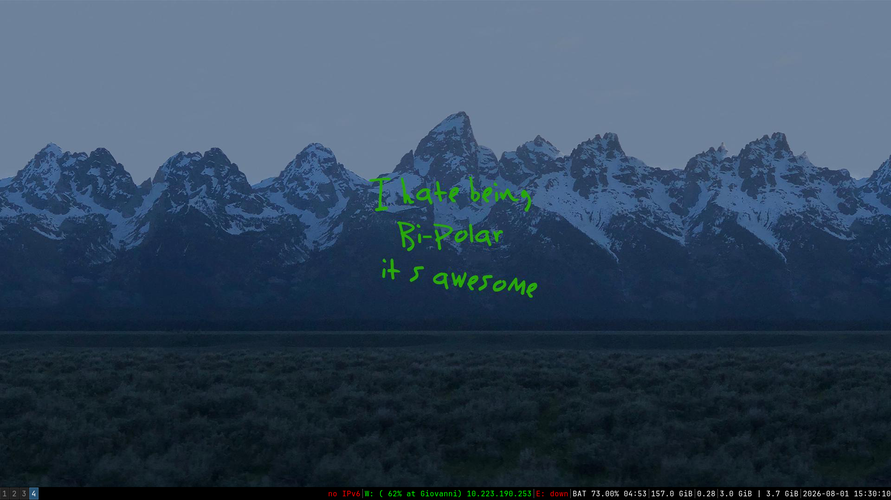
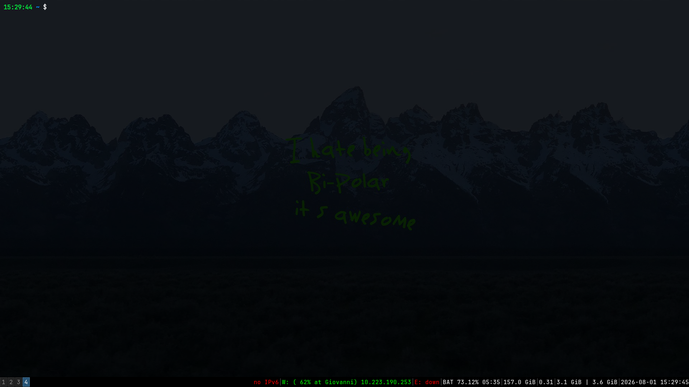
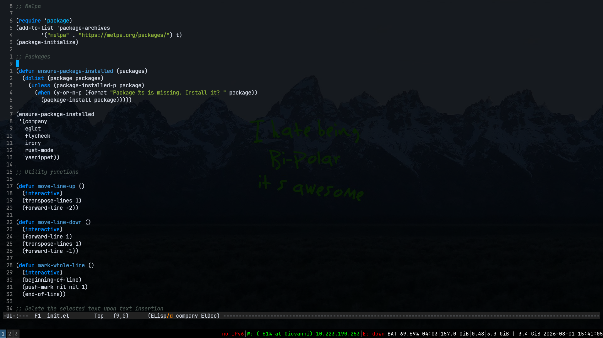

 <br/> <br/>

# 🔧  Configs for my Debian system
This repository contains my lightweight configurations for Zsh, Alacritty, Emacs, i3, and other tools I use daily. They are tailored for low-level programming and optimized to run smoothly even on older machines. It’s a minimal setup, free from heavy frameworks or flashy themes like Oh My Zsh or Doom, designed to keep development fast, clean, and efficient.

## 📥 Installation
The repository includes an `install.sh` script that automates the entire setup process. To run it:
```
chmod +x install.sh
sudo ./install.sh
```
> [!Important]
> Note that `sudo` is required because the script installs packages on your system.

## ⚙️ Utilities
The installation script also sets up a collection of lightweight, essential utilities to enhance productivity and keep the system minimal:
- `Alacritty`: fast, GPU-based terminal emulator
- `Emacs`: a powerful keyboard‑driven text editor
- `Dirvish`: a lightweight file manager inside Emacs
- `Qutebrowser`: minimal web browser
- `ImageMagick`: versatile image editor and converter
- `eza`: a Rust-based ls replacement with icons
- `bat`: a modern cat replacement with syntax highlighting
- `main`: minimal screenshot tool
- `ripgrep`: a fast grep replacement with search highlitghting
- `mpv`: fast media player

Other tools (such as `htop`) aren't installed because they can be easly replaced by Emacs

## 📐 i3

 <br/> <br/>

Since i3 is based on X11, the application launcher is Rofi. Press Super + Space to open it, navigate with the arrow keys or type the name of an app to search, and press Enter to launch your selection.

## ⌨️ Keybinds

In window managers like i3, keybindings are crucial and can make the mouse almost unnecessary. Here are the ones I’ve configured on my system to streamline and accelerate my development workflow.

| Keybind                  | Action                                |
|--------------------------|---------------------------------------|
| Super + B                | Start browser (Qute)                  |
| Super + Enter            | Launch terminal (Alacritty)           |
| Super + Space            | Launch Rofi                           |
| Super + e                | Start Emacs                           |
| Super + h                | Show keybindings help                 |
| Super + w                | Launch Wallpaper Menu                 |
| Super + c                | Launch Wifi Menu                      |
| Super + p                | Launch Power Menu                     |
| Super + print            | Take a screenshot                     |
| Super + [1-9, 0]         | Switch to workspace 1-10              |
| Super + Shift + [1-9, 0] | Move current window to workspace 1-10 |
| Super + q                | Quit window                           |
| Super + Shift + q        | Quit i3                               |
| Super + insert           | Volume up                             |
| Super + delete           | Volume down                           |
| Super + Ctrl + l         | Lock screen (i3lock)                  |
| Super + Alt + f          | Toggle fullscreen                     |

Press Super + h to list all of the keybinds

## 💻 Zsh

 <br/> <br/>

I don’t use frameworks like Oh My Zsh or unusual plugins. Instead, I’ve defined aliases to help with commands I can’t always remember, frequently used long commands, and others that make my terminal cleaner and more user-friendly.

| Alias       | Description                                                    |
|-------------|----------------------------------------------------------------|
| `..`        | Change to the parent directory                                 |
| `cat`       | Maps to `batcat`, a `cat` replacement with syntax highlighting |
| `catp`      | Provides the classic `cat` command                             |
| `clearhist` | Clears zsh history                                             |
| `github`    | Connects to GitHub automatically using an SSH key              |
| `grep`      | An alias for ripgrep, a fast grep replacement                  |
| `ls`        | Maps to `eza`, a Rust-based alternative to `ls` with icons     |
| `la`        | Lists all files in the directory                               |
| `ll`        | Lists files with additional information                        |
| `lt`        | Displays the current directory in a tree-like output           |
| `pwncheck`  | Basic PWN controls like stack canaries and non‑exec stack      |
| `webup`     | Starts a Python http server on port 8080                       |

## 📘 Emacs

 <br/> <br/>

Emacs is configured as the central part of my development workflow. It supports several programming languages, including C/C++, Go, and Python and integrates tools such as Git, terminals, project management, file navigation, PDF viewing, and LSP-based development.

I avoid heavy frameworks such as Doom Emacs or Spacemacs and prefer configuring everything directly with use-package. I use a lightweight setup based on built-in Emacs functionality and a small number of carefully selected packages:
- `cape`: additional completion-at-point backends
- `consult`: enhanced commands for searching buffers, files, lines, and projects
- `corfu`: lightweight in-buffer completion
- `eglot`: LSP integration for programming languages
- `embark`: context-aware actions for selected objects
- `eww`: a built-int text-based web browser
- `magit`: a powerful Git interface inside Emacs
- `marginalia`: adds useful metadata to minibuffer completions
- `multiple-cursors`: Edit multiple locations in a buffer simultaneously.
- `orderless`: flexible, space-separated fuzzy-style completion
- `pdf-tools`: native PDF viewing and navigation
- `vertico`: a clean and efficient completion interface in the minibuffer
- `vterm`: a fully featured terminal emulator inside Emacs
- `which-key`: displays available keybindings after pressing a prefix key

I use the classic Emacs keybindings, but I’ve also configured some of my own because I find them easier to use. 

| Keybind    | Action                      |
|------------|-----------------------------|
| `C-z`      | Undo                        |
| `C-l`      | Mark the whole line         |
| `C-c m m`  | Set mutliple cursors        |
| `C-x b`    | Switch buffers with Consult |
| `C-x d`    | Open Dirvish                |
| `C-x g`    | Open Magit                  |
| `C-x p`    | Project commands            |
| `C-x t`    | Switch to vterm             |
| `C-.`      | Run an Embark action        |
| `C-M-p`    | Starts Proced               |
| `C-M-w`    | Open man pages              |
| `M-<up>`   | Move the line up            |
| `M-<down>` | Move the line down          |

## 🖼️ Wallpapers

To set a new wallpaper, copy it into the `.config/wallpapers` folder, press Super + w, and select it from the wallpaper menu. The chosen wallpaper will be saved and set as the default, so you won’t need to change it each time you log in.

## 🐞 Troubleshooting

### Emacs
- If irony says it can't contact server, run `M-x irony-server-install`
- If irony has "couldn't find irony.el" issue, follow <a href="https://github.com/Sarcasm/irony-mode/issues/592">this guide</a>
- To install go, just type `sudo apt install gopls` in your terminal

🐧 Happy ricing...
